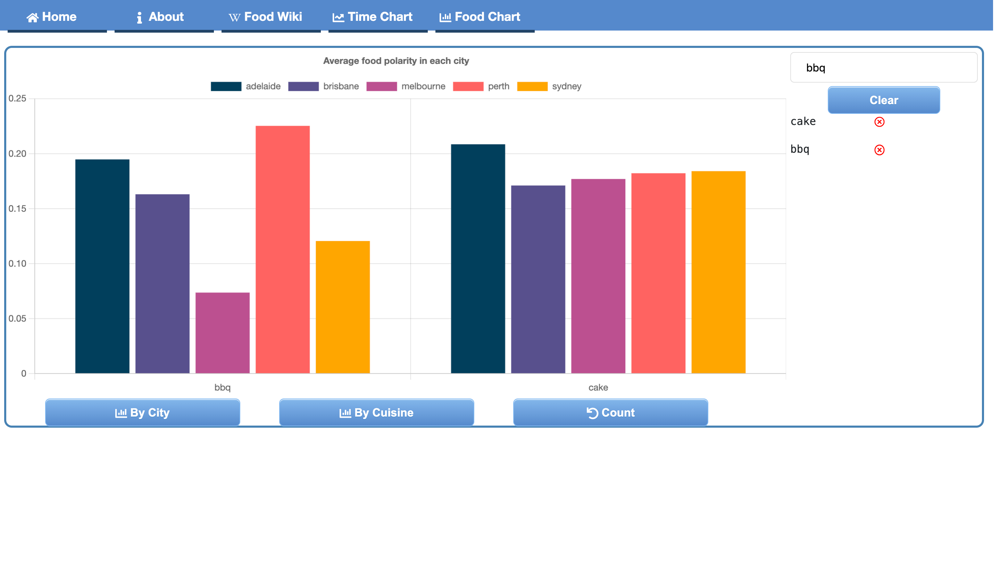
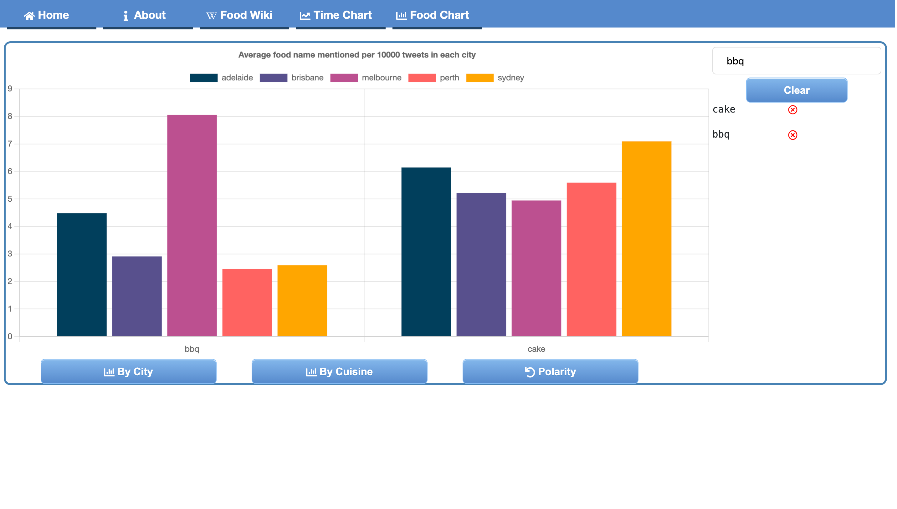

# COMP90024_Assignment2_Group23

# Twitter Crawling Demo
    There is some testing data from twitter fetched by Postman which is used to decide which topic to implement in assignment2.

# Test Data
    There is some data used to test during programming.
    
# Website deploymet guide
[https://github.com/metamophosihots/COMP90024_Assignment2_Group23/tree/main/Front_end/front-end-deploy-file](https://github.com/metamophosihots/COMP90024_Assignment2_Group23/tree/main/Front_end/front-end-deploy-file)

# Website User Guide

## As screenshot above shows:
*  Circle is component
*  Square is functionality

## Components in  Circle:
### 1. Chart component 1  
This component shows 2 different time series line plots of many different measures for each city, 2 plots can be switched around by Functionality 4. Each city has a unique color, and each measure has a unique dashed line. By hovering over the data point, it will show the detail of the data point. 
There is a bigger size version of this component in Functionality 1 - “Time Chart”.
### 2. Leader board component
A list of food sorted by trending index, higher trending index means this food is mentioned more times. This component is scrollable.
### 3. Chart component 2  
This component shows 3 plots of aggregation data for each city which are shown by bars and points; they can be switched around by Functionality 4. By hovering over bars or points, they will show details. 
There is a bigger size version of this component in Functionality 1 - “Food Chart”.
### 4. Food Wiki component  
This is a new page which shows a list of food names, it will lead to wikipedia page by clicking the name.
### 5. About component  
This is a new page which includes the description of this website.

## Functionalties in  Square:
### 1. Menu Bar
Click different buttons to navigate to different components.\
Home - Shows this snapshot\
About - Shows Component 5\
Food Wiki - Shows Component 4\
Time Chart - Shows Component 1, bigger version\
Food Chart - Shows Component 3, bigger version

### 2. Legends for charts
Click each label to eliminate from the chart or show it on the chart if it is eliminated.
### 3. Date Range picker
This is a functionality for Component 1, by setting different dates for start or end date, the chart will dynamically update horizontal time axis and the corresponding data.
### 4. Chart switcher
By clicking them, they can switch chart components to different charts which represent different data and scenarios.
### 5. Search bar
This is designed for “By cuisine” charts of Component 3, by searching different food names and clicking them, those foods data will show in the chart and their names with a red cross button will show below the search bar. 

Below are 2 snapshots of the same charts with different measures, they can be switched by the bottom rightmost button (“count” means switch to count measure, “polarity” means switch to polarity measures). By clicking the red cross button next to the food name, it will eliminate corresponding food from the chart. By clicking clear, all food names will be eliminated from the search bar and chart.

